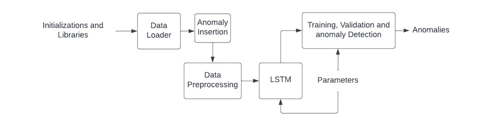

# home-gateway

***1 - Software Analysis:***\
\
The diagram below is an overview of the system's structure, following detailed explanations of each part of the system.

**Data Loader**\
The Data Loader function is used to load the dataset and convert it into the desired data frame. The dataset comprises of patients which are selected when calling the function  using the input string  variable ```patient```.  The data is contained in NumPy format, hence the Data Loader scans through the directory of the data and constructs a data frame using the Pandas library. It is important to note that in order to scan the directories, the OS library is used which provides the ```os.scandir()``` function which is responsible for reading the contents of the directories. Also note that the pathlib library is used to obtain the path name of the directories. This is used for the ```numpy.load("path")``` function accessible by the NumPy library. All of the sensory data are initially stored in the data frame ```sensors_pd```, where each column represents one sensor and the readings of each sensor are stored in a single element of the first row. Since the objective is to construct the data frame of a single sensor, the variable ```Sensor_ID``` is used to select the desired sensor. Afterwards, the sensory data are used to construct a new data frame ```df``` whose columns are time, reading 1 and reading 2. Note that not all sensors have reading 1 or reading 2, hence to ensure correct construction of the data frame, ```if``` statements are used to select the correct column structure. Note that each entry comprising of time and readings comprises of columns for each respectively (i.e column 0 = time, column 1 = Reading 1 etc). The data frame ```df``` is finally the return variable which in this case is a data frame.\
\
**Anomaly Insertion**\
The Anomaly Insertion function is called with the input arguments ```n```, ```type```, ```dataframe``` and ```id```. The variable ```n``` represents the number of anomalies which are to be inserted in the data frame, ```type``` represents the type of anomaly which is to be created, ```dataframe``` is the data frame in which the anomalies will be inserted and finally ```id``` is used to specify the reading value in case that the anomaly generation is an integer ID representing a location (i.e  Reading 1 = 3 is equivalent to Location = Kitchen). The function reads the earliest and latest time stamps of the sensory readings and then creates a random timestamp within that range in which the anomaly will be inserted at. The randomization is done using the Random library which gives access to the ```randint()``` function.  According to the ```type```, the anomaly is then created using specific definitions allowing the creation of various types of anomalies  (the functions containing those anomalies will be detailed afterwards). Then, using a ```for``` loop, the anomaly definitions are called repeatedly with the number of iterations being the value of ```n```, creating a list called ```anomaly_lst```. At the end of the ```for``` loop, the list is used to create a new data frame called ```anomaly_df``` and then the original dataframe is concatenated with the anomaly data frame. The concatenated result is then reordered based on the timestamp of the combined readings.\
\
**PIR Anomaly**\
For the PIR sensor, the anomalous data created are random integer representations of locations with fixed time intervals. For the randomization of the integers, the Random library is used giving access to the ```randint()``` command which generates a random integer within the 0-19 range. The global variables ```pir_time``` and ```pir_key``` are used to ensure that the time stamp is only randomly selected once when the function is called for the first time. The timestamp then increases by 60 each time that an anomaly is being created making the anomalies 60 seconds apart one another.\
\
**Data Prepossessing**\
The data pre-processing part is done after the anomaly insertion function and before the LSTM class. It is where the Data Loader and Anomaly Insertion functions are called. Since several patients are used for training and validation, the resulting data frames of each patient are concatenated together to create the training data and the validation data which are then individually broken down to inputs and labels being ```X_trainD``` / ```X_valD``` and ```Y_trainD``` / ```Y_valD``` respectively. Finally the data frames are converted into PyTorch Tensors, using the command ```torch.tensor()``` and then into floats using ```.float()``` resulting in the final training and validation data (which are used by the machine learning model) ```X_train```/```X_val``` and ```Y_train``` / ```Y_val``` respectively. 
\
**LSTM**\
The LSTM class consist of the machine learning architecture which will be trained with the data set. The model used is Long Short-Term Memory which is a Recurrent Neural Network (RNN) architecture that remembers values over arbitrary intervals. To construct this RNN in python, the PyTorch library is used. The class consists of two definitions, the ```_init_``` which contains all the initialisations of the LSTM subparts and the ```forward```, which assembles those subparts with the correct structure.  The parameters used for the LSTM are: ```num_classes``` which is the number of output classes where in our case they are two (i.e normal, anomaly), ```input_size``` being the size of the input corresponding to the size of each element in the tensors, ```hidden_size``` which is the number of features of the hidden state, the ```num_layers``` which is the number of LSTM layers and finally the ```seq_length``` being the length of the output sequence. Inside the ```_init_``` definition, the initializations of the Relu activation function, the twp LSTM cells and fully connected layers are made. Additionally Dropout is initialized with its argument being the dropout rate.\
\
**Parameters**\
Right before training, the parameters used in the model are set. Firstly the LSTM model parameters are set through the input variables of the LSTM class as specified in the LSTM section. The rest of the parameters are designated training. Those parameters are the optimizer of the model which is SGD accessible using the command ```torch.optim.SGD()```. The criterion is the loss function of the model which is selected to be L1loss via the command ```torch.nn.L1loss()```. The batch size and number of epochs are initialized both with the value of 1. The permutations which are initialized are used for the batch size implementation during training.\
\
**Training, Validation and anomaly detection**\
These functionalities are all executed within the ```Train_AD()``` function. The entire contents of the function are contained in a for loop which repeats for a number of iterations decided by the variable ```n_epochs```. The main body of the function is then broken down in to two subparts. In the first sub part which is used for training, the optimizer’s gradient is initially reset using the PyTorch command ```optimizer.zero_grad()```.  Then the batches are split down using the permutations created previously leading to ```batch_x``` which is the input data batch and ```batch_y``` which is the label batch. Then ```batch_x``` is used as the input of the LSTM model to produce an output using the PyTorch command ```model.forward()```. The output is then compared with ```batch_y``` using the loss function which was initialized previously. Then the loss generated is backwards propagated using the command ```loss.backwards()``` and finally the gradients of the model are updated using ```optimizer.step()```. Once the ```for``` loop of the training process is complete, the anomaly detection and validation ```for``` loop commence. The anomalies are detected by comparing the loss of the current validation batch with a threshold decided by the user based on the loss generated during training. In the validation and anomaly detection loop, the loss calculated is compared using an ```if``` statement with the threshold and if the loss calculated exceeds that threshold, the batch is viewed as anomalous. In this subpart the gredients of the model are not altered, hence the commands used in the training loop are no longer used. The inference time is also calculated for each batch using the time library which gives access to the command ```time.time()```. Hence the inference time taken for a single iteration can be calculated using the difference of the initial time and the end time. The model output of ```batch_x_val``` is compared with the ```batch_y_val``` and if the label is the same as the output, the accuracy variable increments by 1. The final model accuracy is calculated using the accuracy variable value divided with the number of samples used for validation.

***2 - Testbed:***
* Hardware component used as testbed : Raspberry Pi 4
* Server used: Ubuntu desktop 22.04 LTS, Linux
* Programming Language used: Python 3.9.7
* Data set used: >>Write proper name<<
* Micro SD card 256 GB

***3 - Pre requisites:***
* 64 bit, IoT Device with minimum of 9 GB memory
* Linux OS
* Python3: 3.7-3.9 versions
* PyTorch 1.11.10

***4 - Installation Guide:***\
\
**Step 1:**\
Install the Ubuntu desktop 22.04 LTS on  your IoT device via the official website [https://ubuntu.com/download/raspberry-pi] using the Raspberry pi imager, with the instructions provided in the official ubuntu website [https://ubuntu.com/tutorials/how-to-install-ubuntu-desktop-on-raspberry-pi-4#1-overview]
\
\
**Step 2:**\
Python comes pre-installed with Linux . However you can still ensure that the correct python3 version installed using the command  
```$ python3 --version ```. In the event that the version does not satisfy the pre-requisites use the following commands: 
```
$ sudo apt update
$ sudo apt install python 3.9
```
In the case that **pip3** is not installed either, use the command ```$ sudo apt install python3-pip```
\
\
**Step 3:**\
Install the relevant libraries using the following command lines:
```
Pandas: $ sudo apt-get install python3-pandas
```
```
NumPy: $ sudo apt-get install python3-numpy
```
```
Random: $ sudo pip3 install random2
```
PyTorch:\
Initially the correct wheel must be selected (corresponding to the Python version available) via [https://github.com/Qengineering/PyTorch-Raspberry-Pi-64-OS] and downloaded. Then follow the following steps which represent the installation process of PyTorch 1.11.0 for Python 3.9:

download the wheel\
```$ gdown https://drive.google.com/uc?id=1ilCdwQX7bq72OW2WF26Og90OpqFX5g_-```\
install PyTorch 1.11.0\
```$ sudo -H pip3 install torch-1.11.0a0+gitbc2c6ed-cp39-cp39-linux_aarch64.whl```\
clean up\
```$ rm torch-1.11.0a0+gitbc2c6ed-cp39-cp39-linux_aarch64.whl```

In the case of any issues during installation, reference to [https://qengineering.eu/install-pytorch-on-raspberry-pi-4.html] which provides several alternatives.
\
**Step 4:**\
Download the PRISM script via:<enter>


